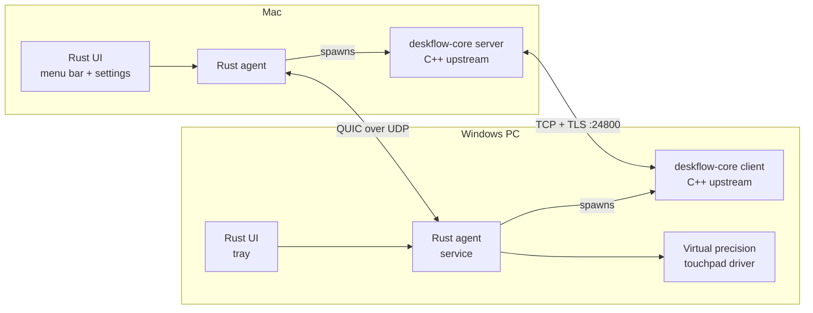
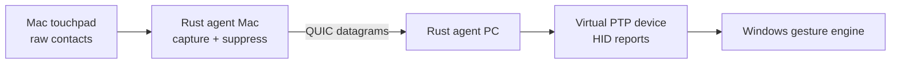
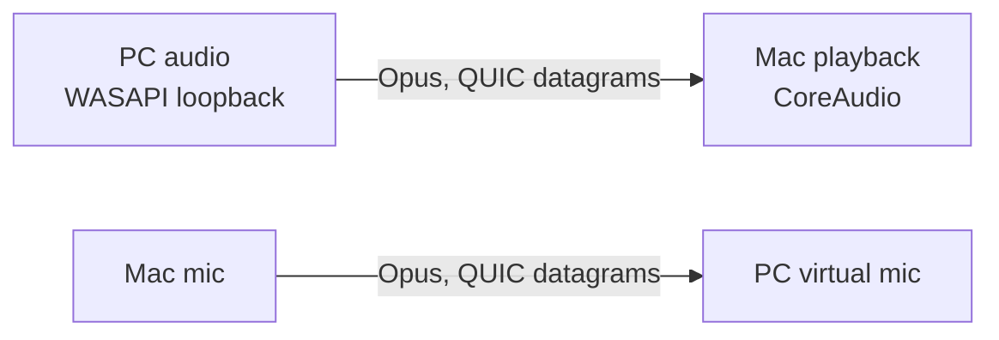

# Crossglide

*Design proposal · draft as of 2026-09-25*

Crossglide is built on [Deskflow](https://github.com/deskflow/deskflow)'s core for one job: a MacBook's keyboard and touchpad controlling a Windows PC, with the PC's audio played on the Mac. The upstream C++ core and its protocol are kept for compatibility; everything new, including both user interfaces, is written in Rust.

## Contents

1. [Scope](#scope)
2. [Architecture](#architecture)
3. [Transport: TCP vs UDP](#transport-tcp-vs-udp)
4. [User interface](#user-interface)
5. [Windows side](#windows-side)
6. [Dev workflow](#dev-workflow)
7. [Feature: precision touchpad on Windows](#feature-precision-touchpad-on-windows)
8. [Feature: one place for logs and config](#feature-one-place-for-logs-and-config)
9. [Feature: MCP support](#feature-mcp-support)
10. [Feature: audio between Mac and PC](#feature-audio-between-mac-and-pc)
11. [Feature: Esparrier ESP32 one-click setup](#feature-esparrier-esp32-one-click-setup)
12. [Compatibility](#compatibility)
13. [Decisions](#decisions)
14. [Open questions](#open-questions)

## Scope

The fork supports exactly one setup: a Mac is the server, and one Windows PC is the client. Anything that doesn't serve that setup is removed.

| Area | Keep | Trim |
| --- | --- | --- |
| Roles | Mac server, Windows client | Mac client, Windows server, Linux (X11, Wayland/`Ei*`) |
| Screen layout | One PC, placed left or right of the Mac | 5 × 3 screen-grid editor, multi-client layouts, aliases UI |
| UI | New Rust UI, the same code on both platforms | Qt GUI |
| Protocol | Upstream Deskflow protocol + TLS fingerprints | Nothing; stock clients must still connect |
| Setup | Pairing code, auto-filled config | Hand-edited server config files |

Trimming starts in the fork's build configuration (don't compile unused platforms and GUI), not by deleting upstream files, so upstream merges stay easy. The actual upstream tree needs checking before anything is removed.

## Architecture

The fork uses two languages. The upstream C++ core moves keyboard, mouse and clipboard over the standard protocol and is rarely touched. A single Rust workspace holds everything new: UI, pairing, logs, config, MCP, audio and touchpad. Rust runs the core as a child process and doesn't link to it, so no FFI bridge is needed.



| Layer | Language | Owns |
| --- | --- | --- |
| Core | C++ (upstream, rarely changed) | Keyboard, mouse, clipboard, screen switching, protocol |
| Agent | Rust (shared crate) | Spawns and supervises the core; pairing; QUIC side channel; logs; config; MCP; audio; touchpad relay |
| UI | Rust (shared crate) | Menu bar/tray, settings window, log viewer, permissions onboarding |
| Platform modules | Rust, per OS | Mac: touch capture, permissions, login item. Windows: service, firewall, virtual touchpad |

Most of upstream is already cross-platform. Only `src/lib/platform/` splits by OS (`MSWindows*` for Windows, `OSX*` for macOS, `Ei*` for Linux Wayland), so a change to shared core code runs on both machines. The same goes for the Rust workspace: only the platform modules differ.

Suggested Rust workspace layout:

```
crates/
  agent/        # side channel, supervisor, config, logs
  ui/           # tray + egui settings window, shared by both OSes
  mcp/          # MCP server
  audio/        # cpal capture/playback, Opus, jitter buffer
  touch/        # contact frames; mac capture, windows inject
  esparrier/    # detect, configure, flash
  platform-mac/
  platform-win/
upstream/       # Deskflow C++ core (git submodule)
```

## Transport: TCP vs UDP

Today Deskflow sends everything over TCP with TLS, on port 24800. The fork keeps that for keyboard and mouse and adds a UDP-based channel for everything new.

| Data | Channel | Protocol | Why |
| --- | --- | --- | --- |
| Keyboard, mouse, clipboard | C++ core (upstream) | TCP + TLS, port 24800 | Nothing may be lost: a lost "Shift up" leaves Shift held on the PC. Stock clients also need it unchanged |
| Logs, config, MCP, pairing | Rust side channel | QUIC reliable streams | Must arrive complete and in order |
| Audio, touch frames | Rust side channel | QUIC unreliable datagrams (UDP) | Low latency matters more than completeness; with TCP, one retransmitted packet stalls everything behind it |

QUIC (the `quinn` crate) runs over UDP and provides both reliable streams and unreliable datagrams in one connection, with TLS 1.3 built in. The side channel trusts the same certificate fingerprints Deskflow already uses, so pairing happens once.

## User interface

Both machines run the same Rust UI code. There's no Swift, Qt or web frontend.

- **Menu bar / tray:** `tray-icon`, which becomes the macOS menu bar icon and the Windows tray icon from one codebase.
- **Settings and log viewer:** `egui`, pure Rust, suited to forms and log views. `Slint` is the fallback if a more polished look matters later; it adds its own markup language.
- **macOS-only bits:** permissions onboarding (Accessibility, Input Monitoring), login item, raw touch capture, through `objc2` or plain C calls. There are only a few of these.
- **Thin by design:** the UI only displays state and calls agent functions (`pair()`, `set_config()`, `tail_logs()`, …). No logic lives in the UI.

Trade-off accepted: the Mac settings window won't look fully native. For a menu-bar tool that's opened occasionally, one codebase is worth more.

## Windows side

The PC needs no full GUI. It runs the Rust agent as a service, a small Rust tray, and the upstream core client. Everything is set up and managed from the Mac.

| Component | Language | Runs as | Does |
| --- | --- | --- | --- |
| `deskflow-core` client | C++ (upstream) | Spawned by the agent, in the user's session | Keyboard, mouse, clipboard |
| Rust agent | Rust | Windows service, starts at boot | Supervises the core; QUIC side channel; logs and config; audio; touch injection |
| Tray | Rust (shared UI crate) | Per user, at login | Status, pairing code, audio switch |
| Virtual precision touchpad | Rust driver (UMDF/KMDF) | Driver | Turns touch frames into precision touchpad input (optional; see ESP32 route) |

- **First run:** run one command on the PC; it shows a pairing code. Enter the code on the Mac, which pushes the screen name, server IP and trusted fingerprints to the PC. Screen-name mismatches (`DESKTOP-LLNMKUS` vs `DESKTOP_LLNMKUS`) can't happen.
- **Firewall:** the agent adds Windows Firewall rules for TCP 24800 and the QUIC port, Private networks only.
- **Login screen and UAC prompts:** upstream already runs a Windows service so input works there. Check upstream's code to decide whether the Rust agent replaces that service or runs alongside it.
- **Version check:** the Mac warns when versions differ.

## Dev workflow

No packaging: no `.app` bundle, installer or Homebrew cask. Rust and C++ are compiled languages, so code is always built before it runs, but one command builds and runs everything, and rebuilds are incremental.

1. `git clone` the repo. Upstream Deskflow is a git submodule at `upstream/`, pinned to a commit.
2. `just dev` (or `make dev`) on either OS: builds the C++ core once with CMake, then `cargo run`s the agent and UI, which spawn the core from the build folder. (Today `just dev` runs only the agent, and `just core` builds the core on macOS; see [ROADMAP.md](ROADMAP.md#m0-workspace).)
3. `cargo watch -x run` rebuilds and restarts on save. Only changed files recompile, usually within seconds. `ccache` speeds up C++ rebuilds.
4. Both machines' logs stream to the terminal that ran the command.

Two practical issues:

- **macOS permissions reset on rebuild.** Accessibility and Input Monitoring are tied to the binary's code signature, so unsigned rebuilds lose them. Sign dev builds with a stable local identity, and have the UI detect missing permissions and open the right Settings page. (During setup on 2026-09-25, missing Input Monitoring showed up as "connected but not working".)
- **Windows driver signing.** The virtual touchpad driver needs test-signing mode on dev machines.

## Feature: precision touchpad on Windows

When control is on the PC, Windows should see the MacBook touchpad as a real Windows Precision Touchpad, so its own gestures work: two-finger scroll, pinch zoom, three- and four-finger swipes, and tap-to-click. Today Deskflow sends only pointer moves and wheel events.



1. **Capture (Mac).** Read raw finger contacts (id, x, y, pressure, state) at about 125 Hz through the private MultitouchSupport framework. It's a C API, as easy to call from Rust as from Swift. The public `NSTouch` API only works while one of our windows is focused, and it isn't while the PC has control. While the PC is active, suppress local macOS gestures (Spaces, Mission Control).
2. **Transport.** Send contact frames, not recognised gestures, as QUIC datagrams. The core keeps sending normal pointer events as a fallback for stock clients.
3. **Inject (Windows).** A virtual HID device with a Precision Touchpad report descriptor receives the frames. Windows does all gesture recognition itself, so no gesture logic needs writing.

| Risk | Why it matters | Mitigation |
| --- | --- | --- |
| Private Mac framework | Can change with macOS updates | Isolate in `platform-mac`; fall back to public gesture events |
| Windows driver | Virtual HID needs a UMDF/KMDF driver, and shipping one needs Microsoft signing | Test-signing for dev; the ESP32 route needs no driver |
| Latency | Gestures feel wrong above about 20 ms | Datagrams, small frames, measured end to end |

## Feature: one place for logs and config

From either machine, you can read both machines' logs in one timeline and edit both machines' settings.

- **Logs:** each agent tails its core's output and its own logs, tagging every line with host, component and timestamp. The UI shows one merged timeline, filterable by host, level and component. Clock offset is measured at pairing.
- **Config:** each machine's settings are one typed document (screen name, PC side, TLS, hotkeys, touchpad, audio). Edits are validated, versioned and applied by the owning machine; if both sides edit, the newer version wins and the older is kept for undo. Files stay readable by upstream Deskflow.
- **Health checks:** the agent detects this project's known setup failures before the user hits them: server not listening, screen-name mismatch, untrusted fingerprint, missing macOS permission, firewall blocking a port.
- **Security:** only a paired machine can read logs or change config.

## Feature: MCP support

The Mac's agent runs an MCP server so an AI assistant can check, set up and fix the connection on both machines. It serves stdio by default; HTTP only when explicitly enabled.

| Tool | What it does | Access |
| --- | --- | --- |
| `status` | Connection state, active screen, versions, permissions on both sides | Read |
| `logs` | Search or tail the merged log by host, level, time | Read |
| `diagnose` | Run health checks; return causes and fixes | Read |
| `config_get` / `config_set` | Read or change either machine's settings | Write, needs confirmation |
| `switch_screen` | Move control to the Mac or the PC | Write |
| `audio_status` / `audio_route` | Audio state, latency; change direction or mute | Read / Write |
| `clipboard` | Read or set the shared clipboard | Write, off by default |
| `esparrier_flash` | Detect, configure and flash an ESP32 | Write, needs confirmation |

MCP never injects arbitrary keystrokes or pointer input; otherwise a prompt-injected assistant could type on the PC. Every write is recorded in the merged log.

## Feature: audio between Mac and PC

The PC's audio plays on the MacBook's speakers or headphones, and optionally the Mac's microphone becomes the PC's mic. That gives one keyboard and one headset for both machines.

The MVP is narrower: PC system audio on the MacBook's built-in speakers only, one way, with fixed settings. Everything else in this section comes after it; see [ROADMAP.md](ROADMAP.md#after-the-audio-mvp).



| Part | Choice | Why |
| --- | --- | --- |
| Capture and playback | `cpal` (pure Rust) | WASAPI loopback on Windows captures system audio with no virtual sound card or driver; CoreAudio on Mac; builds with cargo |
| Fallback | miniaudio | Single C header, Public Domain / MIT-0; built by cargo via `cc` if `cpal` loopback misbehaves |
| Compression | libopus via the `opus` crate (0.4), which builds libopus from source with CMake and links it statically | BSD licence; about 128 kbps stereo sounds close to lossless; a few ms per frame; built-in packet-loss concealment. Measured on the Mac: about 1% of one core to encode ([M1](ROADMAP.md#m1-audio-spike)) |
| Transport | QUIC datagrams | See [Transport](#transport-tcp-vs-udp) |

SonoBus isn't used. It targets multi-party music sessions and depends on JUCE, and its GPL-3.0 licence is incompatible with Deskflow's GPL-2.0. Its ideas (jitter buffering, Opus tuning) are reused, not its code.

The work beyond the two libraries:

1. **Jitter buffer:** buffer 20–40 ms so uneven packet arrival doesn't cause dropouts, growing briefly after a Wi-Fi delay spike (M1 measured spikes up to 85 ms on the Mac's Wi-Fi; see [ROADMAP.md](ROADMAP.md#m1-audio-spike)).
2. **Clock drift compensation:** the two sound cards' clocks differ slightly, so resample a little to keep playback from drifting.
3. **Latency target:** 30–60 ms end to end on a LAN, which is unnoticeable for video.

| Direction | Capture | Playback | Hard part |
| --- | --- | --- | --- |
| PC → Mac | WASAPI loopback, no driver | CoreAudio | Latency tuning only |
| Mac mic → PC | CoreAudio input | Virtual microphone on Windows | Needs a virtual audio driver, or the ESP32 presenting a USB audio device (check whether ESP32-S3 supports this) |

UI controls: audio off / PC → Mac / both ways, a quality/latency preset, and volume. Audio settings live in the shared config, and stats (latency, dropouts, bitrate) go to the merged log.

## Feature: Esparrier ESP32 one-click setup

Plug an ESP32-S3 into the Mac and click once to flash and configure it. Then move it to the PC's USB port, and the PC is controlled with no software installed on it. Esparrier is ESP32 firmware that joins a Deskflow/Barrier server as a client and appears to the host as a USB keyboard and mouse. (That description is from memory; check it against the project first.)

1. **Detect:** find the board over USB serial; read chip type and firmware version.
2. **Configure:** fill in Wi-Fi, server IP and port, screen name and screen size from the fork's own settings, so nothing is typed by hand.
3. **Flash:** write firmware and config with `espflash` (Rust).
4. **Pair:** add the ESP32 to the server layout and trust its fingerprint in the same step.

The ESP32 is also the driver-free route to gestures (and possibly a mic): with a precision touchpad HID descriptor added to its firmware, Windows sees a real touchpad over USB.

| Mode | PC needs | Gestures | Notes |
| --- | --- | --- | --- |
| Software client | Core client + Rust agent (+ signed driver for gestures) | Yes, via the virtual driver | No extra hardware |
| Esparrier ESP32 | Only a USB port | Yes, if its firmware gets the touchpad descriptor | Works on locked-down PCs and at the BIOS screen |

## Compatibility

The fork's server must work with a stock Deskflow 1.26 client, and vice versa. Everything new is optional and switches on only when both sides run the Rust agent.

- The core protocol and TCP port 24800 are unchanged; new features use only the QUIC side channel.
- C++ changes are kept small and upstreamable: they're made on a Deskflow fork and sent upstream as PRs. The submodule moves to newer upstream commits regularly.
- Config files stay readable by upstream Deskflow.
- Licence: GPL-2.0 for the whole project, the same as Deskflow. Dependency licences aren't checked, because this is for personal use and nothing is distributed. Before ever distributing binaries, check them: quinn's TLS crypto (`ring` or `aws-lc-rs`) requires Apache-2.0, which can't be combined with GPL-2.0.

## Decisions

| Decision | Chosen | Rejected, and why |
| --- | --- | --- |
| Languages | Rust for all new code; upstream C++ core kept | Swift (Mac-only, needs a Swift ↔ Rust bridge, second UI) |
| UI | One Rust UI (`tray-icon` + `egui`) on both OSes | Qt (keeps the old GUI), Tauri (adds a web frontend) |
| Core ↔ Rust | Rust spawns the core as a process | FFI linking |
| Licence | GPL-2.0 for everything, the same as Deskflow; dependency licences not checked | A separate licence for crossglide's own code (two licences to track); a licence check (it blocks quinn's TLS crypto, which only matters when distributing) |
| Upstream in the repo | Git submodule at `upstream/`, pinned to a commit | Subtree (brings upstream history into this repo, and upstreaming changes needs `git subtree split`) |
| Keyboard/mouse transport | Upstream TCP + TLS | Changing it would break stock clients and risk stuck keys |
| New-feature transport | QUIC (`quinn`) over UDP | Raw UDP (no encryption or reliable streams), TCP (head-of-line blocking) |
| Audio | `cpal` + libopus, own jitter buffer | SonoBus (GPL-3.0, JUCE, built for multi-party) |
| Touch capture | MultitouchSupport from Rust | `NSTouch` (only works while our window is focused) |

## Open questions

- [ ] Login screen / UAC: replace upstream's Windows service with the Rust agent, or run alongside it?
- [ ] Touchpad: write and sign a virtual driver, or ship the ESP32 route first?
- [ ] Is relying on the private MultitouchSupport framework acceptable?
- [x] Does `cpal` WASAPI loopback work reliably on the target PC, or is miniaudio needed? It works; miniaudio isn't needed ([M1](ROADMAP.md#m1-audio-spike)).
- [x] Mac mic → PC: left out of the audio MVP. Virtual audio driver vs ESP32 USB audio is decided later.
- [ ] Esparrier: confirm its config format, supported boards and licence, and whether upstream would accept a touchpad descriptor.
- [x] Upstream as git subtree or submodule? Submodule; see [Decisions](#decisions).
- [x] Licence: GPL-2.0 throughout, dependency licences not checked; see [Decisions](#decisions).
- [x] Order of work: audio first (PC → Mac), then Rust agent + UI with pairing → logs and config → MCP → Esparrier → touchpad (riskiest last). See [ROADMAP.md](ROADMAP.md).
