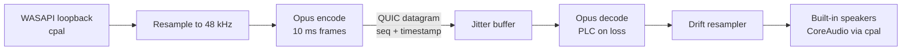

# Crossglide roadmap

*Draft as of 2026-09-25 · builds on the design in [README.md](README.md)*

Audio streaming (PC → Mac) is the first feature. It comes before the Deskflow core, pairing and UI work for four reasons:

- **It needs nothing from the C++ core.** Audio runs entirely in the Rust workspace, so work starts without trimming or integrating upstream.
- **It's useful by itself.** Hearing the PC's audio on the MacBook helps even while keyboard and mouse still run on stock Deskflow.
- **It builds the side channel.** The QUIC connection built for audio is the one logs, config, MCP and touch frames use later.
- **It settles a big risk early.** Whether `cpal` WASAPI loopback works on the target PC is an open question. The answer decides between `cpal` and miniaudio before anything else depends on it.

**MVP scope:** the PC's system audio plays on the MacBook's built-in speakers, in one direction only. Headphones, Bluetooth, device switching, quality presets and the Mac mic are [after the MVP](#after-the-audio-mvp). A single fixed path keeps the MVP cheap to build and easy to debug: when something sounds wrong, there's only one capture device, one codec setting and one output to check.

## Contents

1. [Overview](#overview)
2. [M0: Workspace](#m0-workspace)
3. [M1: Audio spike](#m1-audio-spike)
4. [M2: Side channel](#m2-side-channel)
5. [M3: Audio MVP, PC → Mac speakers](#m3-audio-mvp-pc--mac-speakers)
6. [M4: Audio controls and stats](#m4-audio-controls-and-stats)
7. [After the audio MVP](#after-the-audio-mvp)
8. [Later milestones](#later-milestones)
9. [Latency budget](#latency-budget)
10. [Risks](#risks)
11. [Open questions](#open-questions)

## Overview

| # | Milestone | Delivers | Depends on |
| --- | --- | --- | --- |
| M0 | Workspace | Cargo workspace, `just dev`, CI build on macOS and Windows | – |
| M1 | Audio spike | Evidence that loopback capture, Opus and playback work on the real machines | M0 |
| M2 | Side channel | QUIC connection with pinned fingerprints, a control stream and datagrams | M0 |
| M3 | Audio MVP | PC audio on the MacBook's built-in speakers, with a jitter buffer and drift compensation | M1, M2 |
| M4 | Audio controls | On/off and volume in a config file, stats in the log | M3 |
| M5+ | Everything else | Core integration, pairing, UI, logs and config, MCP, Esparrier, touchpad | M2 |

M1 and M2 are independent and can run in parallel.

Each milestone lists its tasks and a **Done when** condition. A milestone is finished when that condition has been checked on the real Mac and PC, not only in tests.

## M0: Workspace

Set up only what audio needs. Trimming the core build and the UI crates wait until [M5](#later-milestones).

- [x] crossglide is its own git repo, with Deskflow as a submodule at `upstream/`
- [x] Upstream builds on the Mac: Deskflow 1.26.0 at `9ac5464e`, Qt 6.11.2 from Homebrew. 27 of 28 unit-test suites pass; `OSXKeyStateTests` needs Accessibility permission because it sends real keystrokes.
- [x] Cargo workspace with `crates/audio` (library) and `crates/agent` (binary), following the layout in the README
- [x] `justfile` with `just dev`, `just test`, `just lint` (`cargo fmt --check`, `cargo clippy -D warnings`), `just deny`, and `just core` (fetches the submodule and builds the C++ core; macOS only for now)
- [ ] CI builds and tests on `macos-latest` and `windows-latest`: written in `.github/workflows/ci.yml`, not run yet because the repo has no GitHub remote
- [x] Dependency check (`cargo deny`: advisories, bans, sources). Licences aren't checked ([Decisions](README.md#decisions)).
- [x] `LICENSE` (GPL-2.0) at the repo root

**Done when:** a fresh clone builds and passes `just test` on both machines and in CI. Done on the Mac; the PC and CI are still to do.

## M1: Audio spike

Small, throwaway binaries that answer "does this work on our hardware?" before any architecture is built on it. Findings go into [Decisions](README.md#decisions) in the README.

- [ ] **Capture (PC):** record 60 s of system audio from the default output device via `cpal` WASAPI loopback into a WAV file, while playing a video.
- [ ] **Playback (Mac):** play a WAV and a generated sine through `cpal` on CoreAudio, on the built-in speakers.
- [ ] **Opus:** round-trip that WAV through `opus` (or `audiopus`) at 128 kbps stereo, 10 ms frames, `RESTRICTED_LOWDELAY` mode. Measure encode CPU on the PC.
- [ ] **Build:** confirm the Opus crate builds libopus from source on both OSes with no system library installed.
- [ ] **Naive stream:** send Opus frames over plain UDP from PC to Mac with a fixed 40 ms buffer. No QUIC yet. Listen for 10 minutes.

**Done when:** the naive stream sounds clean on the target LAN, or the failures are written down with a decision. If `cpal` loopback fails, the fallback is miniaudio through `cc`.

## M2: Side channel

The QUIC connection every later feature shares. The PC connects to the Mac, the same direction as the Deskflow client and server.

- [ ] `quinn` endpoint in `crates/agent`: the Mac listens and the PC connects, on one configurable UDP port
- [ ] Self-signed certificates on each machine, stored next to the agent config
- [ ] Fingerprint pinning: each side trusts only the peer fingerprint in its config. Fingerprints are copied by hand for now; the pairing code replaces that in M5.
- [ ] Control stream: versioned hello (agent version, features), then typed request/response messages (`serde` + a length prefix)
- [ ] Datagrams enabled; log the negotiated max datagram size at connect
- [ ] Clock offset and RTT estimate: an NTP-style exchange on the control stream every few seconds, for latency stats
- [ ] Reconnect with backoff when either side restarts or the network drops

**Done when:** the two machines stay connected for 24 hours through sleep/wake and a Wi-Fi drop, a wrong fingerprint is refused with a clear log line, and the clock offset is stable to within 1 ms.

## M3: Audio MVP, PC → Mac speakers

The real pipeline, with one fixed path: the PC's default output device in, the MacBook's built-in speakers out. `crates/audio` doesn't depend on `quinn`: it produces and consumes packets, and the agent moves them. That lets tests run the pipeline over a simulated network.

**Packet format**

| Field | Size | Notes |
| --- | --- | --- |
| Version | 1 byte | Rejects mismatched builds; bumped if later features change the format |
| Sequence number | 2 bytes | Wraps; detects loss and reordering |
| Timestamp | 4 bytes | Sample index at 48 kHz; drives jitter buffer and latency stats |
| Opus payload | about 160 bytes | 10 ms at 128 kbps |

**Fixed MVP settings:** 48 kHz stereo, Opus 128 kbps, 10 ms frames, `RESTRICTED_LOWDELAY`, jitter buffer 20–40 ms. Nothing here is configurable yet.

**Tasks**

- [ ] Capture thread → lock-free ring buffer → encode thread. The capture callback never allocates or blocks.
- [ ] Resample the device rate (44.1 or 48 kHz) to 48 kHz at the edges with `rubato` (MIT)
- [ ] Silence: WASAPI loopback sends no data while nothing plays. Detect the gap and send silence or Opus DTX so the Mac doesn't read it as loss.
- [ ] Adaptive jitter buffer: 20 ms target, growing to 40 ms when measured jitter rises and shrinking back slowly
- [ ] Loss: Opus packet-loss concealment for single gaps
- [ ] Clock drift: steer the playback resampler by jitter-buffer fill level, within ±500 ppm
- [ ] Start and stop over the control stream, so the PC only captures while the Mac is listening
- [ ] If either device disappears, stop cleanly with a clear log line; restarting the agent recovers
- [ ] Test harness: run the pipeline through a simulated link with configurable loss, jitter, reordering and clock skew. Assert no underruns at 1% loss and 10 ms jitter, and bounded buffer size under ±300 ppm skew.

**Done when**, measured on the real machines:

- end-to-end latency is 60 ms or less on Wi-Fi and 45 ms or less on Ethernet ([budget](#latency-budget))
- one hour of music has no audible dropouts
- two hours of playback show no drift (buffer fill stays within target)

## M4: Audio controls and stats

There's no UI yet, so controls are a config file and CLI flags. The typed shared config in M7 takes this file over unchanged.

- [ ] `audio` section in the agent's TOML config: `enabled` (true/false) and `volume`
- [ ] CLI: `crossglide-agent audio status` prints current latency, jitter-buffer depth, loss %, bitrate, and device names
- [ ] Stats go to the log through `tracing` every 10 s, and immediately on dropouts
- [ ] Document the PC's own speakers: whether they can be muted without muting the loopback ([open question](#open-questions))

**Done when:** you can turn audio on and off and change the volume without restarting, and the log alone is enough to explain a dropout afterwards.

## After the audio MVP

Not planned in detail. Each item is picked up only once the MVP has been used day to day and the need is real.

| Item | Why it's deferred |
| --- | --- |
| Headphones and other Mac outputs | Each output has its own buffer size and latency; the MVP proves the pipeline on one |
| Bluetooth output (AirPods) | Adds 100–200 ms we can't remove; needs latency shown in the UI |
| Device switching without restart (both sides) | Hot-plug handling is fiddly and easy to get wrong; restarting is fine for an MVP |
| Quality presets, FEC, 5 ms frames | Tune only after real latency and loss numbers exist |
| Mac mic → PC | Needs a virtual microphone driver on Windows or ESP32 USB audio |

## Later milestones

These keep the README's order after audio. Each gets its own task list when it's next.

| # | Milestone | Summary |
| --- | --- | --- |
| M5 | Core and agent | Trimmed build config, agent spawns and supervises `deskflow-core`, pairing code replaces hand-copied fingerprints, Windows service and firewall rules |
| M6 | UI | `tray-icon` menu bar and tray, `egui` settings window, macOS permissions onboarding; audio controls move here |
| M7 | Logs and config | Merged log timeline, typed shared config, health checks |
| M8 | MCP | MCP server on the Mac agent, including `audio_status` / `audio_route` |
| M9 | Esparrier | Detect, configure and flash an ESP32-S3 |
| M10 | Touchpad | MultitouchSupport capture, contact frames over datagrams, virtual precision touchpad (riskiest, so last) |

## Latency budget

Estimated for the fixed MVP settings. M3 measures each stage and replaces these numbers.

| Stage | Estimate | Notes |
| --- | --- | --- |
| WASAPI capture period | 10 ms | Shared-mode default |
| Opus frame + lookahead | 12.5 ms | 10 ms frame + 2.5 ms in `RESTRICTED_LOWDELAY` |
| Network | 1–5 ms | LAN; Wi-Fi spikes are absorbed by the jitter buffer |
| Jitter buffer | 20 ms | Grows to 40 ms under jitter |
| CoreAudio output buffer | 5–10 ms | Built-in speakers |
| **Total** | **about 50–60 ms** | 5 ms frames would save about 10 ms at higher CPU and bitrate (after the MVP) |

Measuring: the in-band timestamp plus the clock offset from M2 gives capture-to-playback latency continuously. Check it once acoustically: record a click through both machines' speakers with a phone and compare.

## Risks

| Risk | Why it matters | Mitigation |
| --- | --- | --- |
| `cpal` loopback misbehaves | Blocks the whole feature | M1 tests it first; miniaudio fallback |
| Wi-Fi jitter | MacBook Wi-Fi power-saving can cause 50 ms+ spikes | Adaptive jitter buffer; recommend Ethernet in docs; stats show the cause |
| Capture from a Windows service | The M5 agent runs as a service, and session 0 may not capture the user's audio | The MVP runs from a terminal in the user's session; for M5, audio capture runs as a helper in the user's session, like the core client |
| Drift compensation artefacts | Bad resampler steering sounds like wow or flutter | Small, slow corrections; test over hours with skew in the harness |

## Open questions

- [ ] Does `cpal` WASAPI loopback work reliably on the target PC? (M1 answers this; also in the README)
- [ ] Can the PC's speakers be silenced while loopback still captures audio, or does muting the endpoint also mute the capture?
- [ ] Should audio capture on Windows run in a user-session helper spawned by the service? (Needed before M5)
- [ ] One QUIC port, or share one with Deskflow's port number (24800/UDP)?
