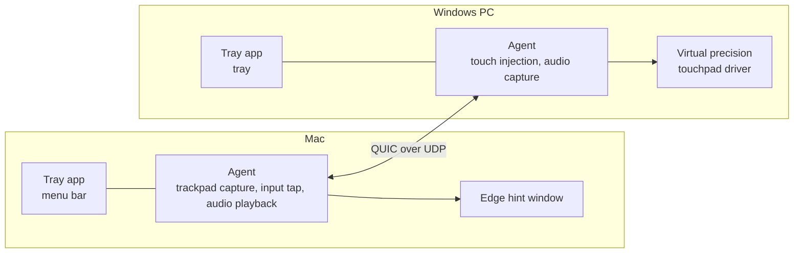
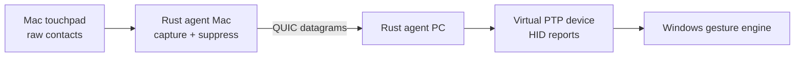
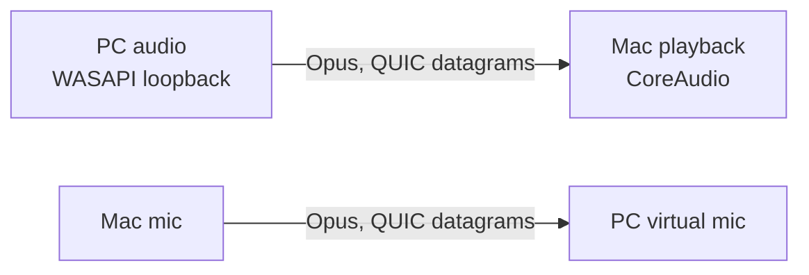

# Crossglide

*Design document · draft as of 2026-09-30 · the project overview is in the [README](../README.md)*

Crossglide is one job done in pure Rust: a MacBook's trackpad and keyboard control a Windows PC, and the PC's audio plays on the Mac. It shares its idea with software KVMs such as Deskflow (move the pointer off one screen's edge and it arrives on the other machine), but it shares no code or protocol with them. The wire protocol, both user interfaces and every feature are its own, and the only non-Rust code is the small Windows touchpad driver.

## Contents

1. [Scope](#scope)
2. [Architecture](#architecture)
3. [Transport](#transport)
4. [User interface](#user-interface)
5. [Windows side](#windows-side)
6. [Dev workflow](#dev-workflow)
7. [Feature: precision touchpad on Windows](#feature-precision-touchpad-on-windows)
8. [Feature: one place for logs and config](#feature-one-place-for-logs-and-config)
9. [Feature: MCP support](#feature-mcp-support)
10. [Feature: audio between Mac and PC](#feature-audio-between-mac-and-pc)
11. [Idea on hold: an ESP32 as the PC's input device](#idea-on-hold-an-esp32-as-the-pcs-input-device)
12. [Licence and dependencies](#licence-and-dependencies)
13. [Decisions](#decisions)
14. [Open questions](#open-questions)

## Scope

Crossglide supports exactly one setup: a Mac controls one Windows PC. Anything that doesn't serve that setup isn't built.

| Area | In | Out, for now |
| --- | --- | --- |
| Machines | One Mac (the controller) and one Windows 11 PC | Linux, several PCs, a PC controlling the Mac |
| Input | The Mac's trackpad as a Windows Precision Touchpad, and the Mac's keyboard | Other pointing devices; clipboard sharing |
| Screen layout | The PC sits on any side of the Mac (`[touch] edges`) | Multi-monitor layout editors |
| Audio | PC system audio on the Mac's speakers | The Mac's microphone as the PC's mic (see [audio](#feature-audio-between-mac-and-pc)) |
| UI | A tray or menu bar app on both machines | A settings window (planned) |
| Setup | Fingerprints copied into `agent.toml` by hand | A pairing code (planned) |

## Architecture

One Rust workspace holds everything. The two machines run the same agent and the same tray app, which differ only in their platform modules. There's no second language and no helper process: the agent runs inside the tray app.



| Layer | Language | Owns |
| --- | --- | --- |
| Agent (`crates/agent`) | Rust | The QUIC side channel, control messages, clock sync, config, and the audio and touch sessions |
| Touch (`crates/touch`) | Rust | Contact frames, touchpad reports, edge geometry, the key map; Mac capture and input tap; Windows feed writer and driver installer |
| Audio (`crates/audio`) | Rust | Capture, Opus, jitter buffer, drift-compensating playback |
| UI (`crates/ui`) | Rust | Menu bar or tray icon, menu items, the edge hint window |
| Driver (`drivers/touchpad`) | C (UMDF 2) | Passing finished touchpad reports to Windows |

Platform-specific code stays small: on the Mac, the MultitouchSupport capture, the Quartz event tap and the hint window; on Windows, the driver feed, `SendInput` and the driver installer. Everything else runs unchanged on both.

Workspace layout:

```
crates/
  agent/        # side channel, control messages, config, audio and touch sessions
  audio/        # cpal capture/playback, Opus, jitter buffer
  touch/        # contact frames; mac capture, windows inject and install
  ui/           # tray app
  spike/        # the throwaway audio spike (M1)
  mcp/          # planned: MCP server
drivers/
  touchpad/     # the virtual precision touchpad driver, with a signed build in package/
```

## Transport

Everything travels over one QUIC connection (the `quinn` crate), which provides reliable streams and unreliable datagrams together, with TLS 1.3 built in. The PC connects to the Mac, which listens on one UDP port (24800 by default).

| Data | Channel | Why |
| --- | --- | --- |
| Keys, control messages (switching, hello, audio start and stop) | Reliable stream | Nothing may be lost: a lost "Shift up" leaves Shift held on the PC |
| Touch frames | Unreliable datagrams | Low latency matters more than completeness; with TCP, one retransmitted packet stalls everything behind it. A newer frame replaces a lost one |
| Audio | Unreliable datagrams | The same, and Opus conceals a lost frame |
| Logs, config, MCP, pairing | Reliable streams (planned) | Must arrive complete and in order |

Each machine has its own self-signed certificate and trusts only the other machine's fingerprint, which is checked right after the handshake ([M2](../ROADMAP.md#m2-side-channel)). Until pairing exists ([M5](../ROADMAP.md#later-milestones)), the fingerprint is copied into `agent.toml` by hand. The hello on the control stream carries the protocol and agent versions and the features each side supports: a different protocol version is refused, a different agent version only warns, and a feature is used only when both sides list it.

## User interface

Both machines run the same Rust UI code. There's no Swift, Qt or web frontend.

- **Menu bar / tray:** `tray-icon`, which becomes the macOS menu bar icon and the Windows tray icon from one codebase.
- **Settings and log viewer:** `egui`, pure Rust, suited to forms and log views (planned). `Slint` is the fallback if a more polished look matters later; it adds its own markup language.
- **macOS-only bits:** permissions onboarding (Accessibility, Input Monitoring), login item, raw touch capture, through `objc2` or plain C calls. There are only a few of these.
- **Edge hint (Mac):** when the pointer leaves through a screen edge, a thin frosted-glass strip covers that edge for as long as the PC has control. It's one borderless, click-through window in the tray app's own event loop, with the blur from a Rust crate (`window-vibrancy`, or `objc2-app-kit` directly): no Swift or Objective-C files. A fixed width, no text, no icons, no settings.
- **Start at login:** a menu item on both OSes (a `Run` registry value on Windows, a LaunchAgent on the Mac).
- **Install touchpad driver (Windows only):** a tray menu item that installs the virtual touchpad driver, so the PC needs no PowerShell script or build tools. The menu is the same on both OSes: on the Mac the item is greyed out and labelled "(Windows only)", the way *Start at login* is greyed out where it isn't supported. Only the installer behind it is Windows code. See [Installing the driver from the tray](#installing-the-driver-from-the-tray).
- **Thin by design:** the UI only displays state and calls agent functions (`pair()`, `set_config()`, `tail_logs()`, …). No logic lives in the UI.

Trade-off accepted: the Mac settings window won't look fully native. For a menu-bar tool that's opened occasionally, one codebase is worth more.

## Windows side

The PC needs no full GUI. Today it runs the tray app, which runs the agent in the user's session; everything can be set up from the Mac once pairing exists.

| Component | Language | Runs as | Does |
| --- | --- | --- | --- |
| Tray app (with the agent) | Rust | Per user, at login | Status, audio switch, touch injection, driver install |
| Virtual precision touchpad | C driver (UMDF 2), installed by the Rust tray | Driver | Turns touch frames into precision touchpad input (optional; see the ESP32 idea) |

- **First run:** run one command on the PC; it shows a pairing code. Enter the code on the Mac, which pushes the server address and trusted fingerprints to the PC (planned).
- **Firewall:** the agent adds a Windows Firewall rule for the QUIC port, Private networks only (planned).
- **Login screen and UAC prompts:** input sent from a user-session program can't reach them. Running the agent as a Windows service, with a helper in the user's session, would (planned; see [Open questions](#open-questions)).
- **Version check:** see [Transport](#transport): the hello refuses a different protocol and warns on a different agent version.

## Dev workflow

No packaging: no `.app` bundle, installer or Homebrew cask, and no release builds. Every machine runs dev builds from source, so nothing has to be built and shipped separately for each platform; that waits until the app is mature. Rust is compiled, so code is always built before it runs, but one command builds and runs everything, and rebuilds are incremental.

1. `git clone` the repo.
2. `just tray` runs the tray app from source (on the Mac, double-click `scripts/tray.command`; on Windows, drag `scripts\tray.ps1` into PowerShell), and `just dev` runs only the agent. CMake is needed once, because the `opus` crate builds libopus from source.
3. `cargo watch -x run` rebuilds and restarts on save. Only changed files recompile, usually within seconds.
4. Both machines' logs stream to the terminal that ran the command, and to `agent.log`.

Two practical issues:

- **macOS permissions reset on rebuild.** Accessibility and Input Monitoring are tied to the binary's code signature, so unsigned rebuilds lose them. Sign dev builds with a stable local identity, and have the UI detect missing permissions and open the right Settings page. (During setup on 2026-09-25, missing Input Monitoring showed up as "connected but not working".)
- **Windows driver signing.** The virtual touchpad driver is signed with a locally trusted certificate, so test-signing mode isn't needed ([drivers/touchpad](../drivers/touchpad/README.md)). Building it needs the WDK; installing a prebuilt package doesn't.

## Feature: precision touchpad on Windows

When control is on the PC, Windows should see the MacBook touchpad as a real Windows Precision Touchpad, so its own gestures work: two-finger scroll, pinch zoom, three- and four-finger swipes, and tap-to-click. Software KVMs usually send only pointer moves and wheel events, which loses all of that.



1. **Capture (Mac).** Read raw finger contacts (id, x, y, state) through the private MultitouchSupport framework. It's a C API, as easy to call from Rust as from Swift. The public `NSTouch` API only works while one of our windows is focused, and it isn't while the PC has control. While the PC is active, a Quartz event tap swallows the Mac's own input, so local gestures, clicks and keys don't reach the Mac.
2. **Transport.** Send contact frames, not recognised gestures, as QUIC datagrams, straight from the trackpad's callback. Keys go over the control stream, which is reliable, so a key-up is never lost.
3. **Inject (Windows).** A virtual HID device with a Precision Touchpad report descriptor receives the frames ([drivers/touchpad](../drivers/touchpad/README.md)). Windows does all gesture recognition itself, so no gesture logic needs writing. Keys are typed with `SendInput`.

**Switching control.** The Mac's `[touch] edges` (any of left, right, top, bottom) lead to the PC: pushing the pointer through one moves control there, and pushing it through the PC's opposite side brings it back. The PC notices that push from the contacts, because the pointer itself is stuck on the edge. A hotkey (`ctrl+option+cmd+space` by default) switches either way and always works, even if the PC doesn't answer. If the connection drops, control goes back to the Mac at once.

**Edge hint.** While the PC has control, the Mac shows a frosted-glass strip over the edge the pointer left through, on the display it left from; it goes away the moment control returns, by any route (push, hotkey or dropped connection). Entering by the hotkey has no exit edge: the first entry in `edges` stands in for it, and with no `edges` there's no strip. The strip needs the tray app, since only its event loop can own a window; the plain `crossglide-agent` command goes without.

### Installing the driver from the tray

On Windows the tray menu has **Install touchpad driver** (on the Mac the same item is greyed out, "Install touchpad driver (Windows only)"). The driver comes with the repo, so there's nothing to download: a `git pull` brings it, and the tray installs it. The app is all Rust; the driver itself stays the C UMDF driver, because `windows-drivers-rs` still can't build a HID minidriver ([Decisions](#decisions)).

1. **The package is in the repo.** `drivers/touchpad/package/` holds the built and signed driver: the DLL, the `.inf`, the signed `.cat` and the public `.cer`. It's copied there by hand from `build.ps1`'s output (`target\touchpad\package`, plus the certificate exported from the PC's store) whenever the driver changes, and committed. The signing key stays on the PC that built it.
2. **The exe carries it.** The Windows build of the tray embeds those four files with `include_bytes!`, so the app installs exactly the driver it was built with.
3. **One click, one UAC prompt.** The item asks for confirmation, then the app starts itself again with the `runas` verb and `--install-driver`. Nothing else in the app ever runs elevated.
4. **Install (elevated).** The helper writes the files into `%ProgramFiles%\Crossglide\driver`, which only administrators can write to (a normal user can't swap them before they're installed), then: trusts the `.cer` with `certutil -addstore` (Root and TrustedPublisher); creates the root device `Root\CrossglideTouchpad` if missing (SetupAPI: `pnputil` on Windows 11 build 26200 has no `/add-device`); and runs `pnputil /add-driver … /install`. Its exit code and message go to the log.

It's safe to click again: installing over an installed driver updates it, so the tray never has to work out the device's state. To remove the driver, use `build.ps1 -Uninstall`. The agent's "touchpad isn't installed" message points at the menu item.

**Trust.** Installing the certificate makes this machine trust whatever that key signs. The certificate comes from the repo, so trusting it is trusting the repo, as with the app itself. This suits a personal project; public distribution needs Microsoft's attestation signing instead, which removes the certificate step.

## Feature: one place for logs and config

From either machine, you can read both machines' logs in one timeline and edit both machines' settings.

- **Logs:** each agent tags every log line with host, component and timestamp. The UI shows one merged timeline, filterable by host, level and component. Clock offset is already measured on the side channel ([M2](../ROADMAP.md#m2-side-channel)).
- **Config:** each machine's settings are one typed document (PC side, TLS, hotkeys, touchpad, audio). Edits are validated, versioned and applied by the owning machine; if both sides edit, the newer version wins and the older is kept for undo.
- **Health checks:** the agent detects this project's known setup failures before the user hits them: the other machine unreachable, an untrusted fingerprint, a missing macOS permission, a firewall blocking the QUIC port, the touchpad driver missing.
- **Security:** only a paired machine can read logs or change config.

## Feature: MCP support

The Mac's agent runs an MCP server so an AI assistant can check, set up and fix the connection on both machines. It serves stdio by default; HTTP only when explicitly enabled.

| Tool | What it does | Access |
| --- | --- | --- |
| `status` | Connection state, active screen, versions, permissions on both sides | Read |
| `logs` | Search or tail the merged log by host, level, time | Read |
| `diagnose` | Run health checks; return causes and fixes | Read |
| `config_get` / `config_set` | Read or change either machine's settings | Write, needs confirmation |
| `switch_screen` | Move control to the Mac or the PC | Write |
| `audio_status` / `audio_route` | Audio state, latency; change direction or mute | Read / Write |

MCP never injects arbitrary keystrokes or pointer input; otherwise a prompt-injected assistant could type on the PC. Every write is recorded in the merged log.

## Feature: audio between Mac and PC

The PC's audio plays on the MacBook's speakers or headphones, and optionally the Mac's microphone becomes the PC's mic. That gives one keyboard and one headset for both machines.

The MVP is narrower: PC system audio on the MacBook's built-in speakers only, one way, with fixed settings. Everything else in this section comes after it; see [ROADMAP.md](../ROADMAP.md#after-the-audio-mvp).



| Part | Choice | Why |
| --- | --- | --- |
| Capture and playback | `cpal` (pure Rust) | WASAPI loopback on Windows captures system audio with no virtual sound card or driver; CoreAudio on Mac; builds with cargo |
| Fallback | miniaudio | Single C header, Public Domain / MIT-0; built by cargo via `cc` if `cpal` loopback misbehaves |
| Compression | libopus via the `opus` crate (0.4), which builds libopus from source with CMake and links it statically | BSD licence; about 128 kbps stereo sounds close to lossless; a few ms per frame; built-in packet-loss concealment. Measured on the Mac: about 1% of one core to encode ([M1](../ROADMAP.md#m1-audio-spike)) |
| Transport | QUIC datagrams | See [Transport](#transport) |

SonoBus isn't used. It targets multi-party music sessions and depends on JUCE, and its GPL-3.0 licence doesn't combine with this project's GPL-2.0-only. Its ideas (jitter buffering, Opus tuning) are reused, not its code.

The work beyond the two libraries:

1. **Jitter buffer:** buffer 20–40 ms so uneven packet arrival doesn't cause dropouts, growing after a Wi-Fi delay spike and coming back down a few minutes later (M1 measured spikes up to 85 ms on the Mac's Wi-Fi). Built in [M3](../ROADMAP.md#m3-audio-mvp-pc--mac-speakers): the target follows how late packets actually arrive.
2. **Clock drift compensation:** the two sound cards' clocks differ slightly, so resample a little to keep playback from drifting. In M3 the same resampler also converts to the output device's rate and brings the buffer back down after a spike.
3. **Latency target:** 30–60 ms end to end on a LAN, which is unnoticeable for video. M3 measures it continuously and logs it every 10 s.

| Direction | Capture | Playback | Hard part |
| --- | --- | --- | --- |
| PC → Mac | WASAPI loopback, no driver | CoreAudio | Latency tuning only |
| Mac mic → PC | CoreAudio input | Virtual microphone on Windows | Needs a virtual audio driver, or an ESP32 presenting a USB audio device (check whether ESP32-S3 supports this) |

UI controls: audio off / PC → Mac / both ways, a quality/latency preset, and volume. Audio settings live in the shared config, and stats (latency, dropouts, bitrate) go to the merged log.

## Idea on hold: an ESP32 as the PC's input device

An ESP32-S3 plugged into the PC's USB port can appear as a keyboard, mouse or even a precision touchpad, so the PC would be controlled with no software installed on it, including at the BIOS screen and on locked-down PCs. The catch: firmware such as Esparrier that already does this speaks Deskflow's protocol, which Crossglide doesn't. Using it would mean either implementing that protocol or writing firmware for Crossglide's own, so this is on hold until the software route is mature. (What Esparrier does is described from memory; check it against the project first.)

| Mode | PC needs | Gestures | Notes |
| --- | --- | --- | --- |
| Software (today) | The tray app, plus the signed driver for gestures | Yes, via the virtual driver | No extra hardware |
| ESP32 | Only a USB port | Yes, if its firmware gets the touchpad descriptor | Needs firmware that speaks Crossglide's protocol |

## Licence and dependencies

GPL-2.0-only for the whole project. It was chosen while Crossglide was planned as a Deskflow fork; no Deskflow code is in it now, so the licence is free to be reconsidered ([Open questions](#open-questions)). Dependency licences aren't checked, because this is for personal use and nothing is distributed. Before ever distributing binaries, check them: quinn's TLS crypto (`ring` or `aws-lc-rs`) requires Apache-2.0, which can't be combined with GPL-2.0.

## Decisions

| Decision | Chosen | Rejected, and why |
| --- | --- | --- |
| Languages | Rust for all code except the Windows driver, which is C | Swift (Mac-only, needs a Swift ↔ Rust bridge, second UI) |
| Deskflow | None of its code or protocol: keys, touch and switching are Crossglide's own, in Rust. It was vendored as a submodule until 2026-09-30, when nothing used it | Keeping its C++ core (a second language and build system, and its protocol can't carry touch frames); staying protocol-compatible (limits every new feature) |
| UI | One Rust UI (`tray-icon` + `egui`) on both OSes | Qt, Tauri (adds a web frontend) |
| Licence | GPL-2.0-only; dependency licences not checked | A licence check (it blocks quinn's TLS crypto, which only matters when distributing) |
| Transport | QUIC (`quinn`) over UDP: keys on a reliable stream, touch and audio as datagrams | Raw UDP (no encryption or reliable streams), TCP (head-of-line blocking) |
| Audio | `cpal` + libopus, own jitter buffer | SonoBus (GPL-3.0, JUCE, built for multi-party) |
| Touch capture | MultitouchSupport from Rust | `NSTouch` (only works while our window is focused) |
| Virtual touchpad | A UMDF 2 HID driver in C, a dumb pipe for reports the agent builds | KMDF with VHF (a bug crashes Windows), a Rust driver (`windows-drivers-rs` has no HID minidriver support yet; the driver is about 500 lines that rarely change), the ESP32 (needs hardware) |
| Touch switching | Crossglide switches control itself: screen edges and a hotkey, keys over the control stream | Reusing another KVM's switching (brings its core and protocol back) |
| Edge hint | A frosted-glass strip in a tray-app window, Rust only (`window-vibrancy` or `objc2-app-kit`) | A separate Swift helper (a second language and a bridge); a system notification (too slow and too easy to miss); text or icons on the strip (more to design and localise, for no gain) |
| Driver install | The tray installs the signed package that's committed in the repo and embedded in the exe: `certutil` and `pnputil` for the certificate and the driver, a little SetupAPI for the device, UAC only for the install step | A download from a GitHub release (it adds an HTTP client, hashes and a release step); keeping `build.ps1` as the only route (needs the WDK and PowerShell on every PC); a full SetupAPI and CryptoAPI installer with status, update and remove (more code than the job needs); an installer (release packaging comes last) |

## Open questions

- [ ] Login screen / UAC: run the agent as a Windows service, with a helper in the user's session, so input works there?
- [x] Touchpad: write and sign a virtual driver, or ship the ESP32 route first? The driver: a UMDF 2 driver with a local test certificate, no test mode ([drivers/touchpad](../drivers/touchpad/README.md)).
- [ ] Is relying on the private MultitouchSupport framework acceptable?
- [x] Does `cpal` WASAPI loopback work reliably on the target PC, or is miniaudio needed? It works; miniaudio isn't needed ([M1](../ROADMAP.md#m1-audio-spike)).
- [x] Mac mic → PC: left out of the audio MVP. Virtual audio driver vs ESP32 USB audio is decided later.
- [x] Keep Deskflow's core? No: Crossglide is pure Rust, and the submodule was removed (2026-09-30); see [Decisions](#decisions).
- [ ] Clipboard sharing: Deskflow's core would have provided it; now it needs building, or is left out.
- [ ] ESP32 route: speak the Deskflow/Barrier protocol for existing firmware, or write firmware for Crossglide's own?
- [ ] Licence: keep GPL-2.0-only now that no Deskflow code is in the project, or choose another?
- [x] Order of work: audio first (PC → Mac), then Rust agent + UI with pairing → logs and config → MCP → touchpad (riskiest last). Touchpad was brought forward; see [ROADMAP.md](../ROADMAP.md).
